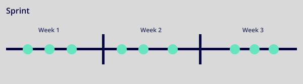

# Choices, Choices - The Tech-stack

## Projecinrichting

Over uitbreiding van je Scrum skills.

### Aanpak
<!-- We schrijven in principe geen tutorials maar helpen ze op weg. -->

Vorige sprint hebben we de standup, scrum rollen en sprintplanning behandeld. Om een goede sprintplanning uit te kunnen voeren is het belangrijk dat de stories klaar zijn om opgepakt te worden. Dit wordt gedaan in een refinement.

1. Refinement

### 1. Refinement

Om ervoor te zorgen dat stories echt klaar zijn om opgepakt te worden in de sprintplanning doen we een refinement. In deze meeting zorg je met elkaar ervoor dat de stories die nog op de backlog staan duidelijk zijn omschreven, gepokerd zijn en voldoen aan de Definition of Ready (die je samen hebt afgesproken).

**🛠️ Opdracht 1 - DoR en DoD (30 min)**  

Doe deze oefening op het whiteboard.

1. Onderzoek wat een DoR en een DoD is. Schrijf de betekenis op het whiteboard
2. Bedenk nu wat jullie DoR en DoD's zijn jullie stories, schrijf ze op het whiteboard
3. Overleg de DoR en de DoD met een docent en zet ze dan in jullie `CONTRIBUTING.md`

**🛠️ Opdracht 2 - Refinement (30 min)**  

Doe deze oefening op het whiteboard.

1. Zoek uit wat een refinement is, schrijf op het whiteboard een korte beschrijving
2. Voer een refinement op de eerste 5 stories op de backlog uit
3. Check of de stories nu voldoen aan de Definition of ready

**🛠️ Opdracht 3 - Verloop van een sprint (30 min)**  

Doe deze oefening op het whiteboard.

1. Maak een timeline op het bord van een sprint met de Scrum onderdelen die we de afgelopen sprints hebben behandeld (ook vandaag).

_Welke onderdelen van Scrum waar in de de sprint_

#### Extra bronnen
<!-- Extra links voor documentatie en tutorials -->

- [Scrum @ Scrum.org](https://www.scrum.org)
- [Scrum @ Agile Scrum Group](https://agilescrumgroup.nl)

### ✒️ Leervragen

Zet de antwoorden in je learning journal:
1. Hoe ging de refinement op de backlog?
2. Hoe helpt een refinement jouw project?
