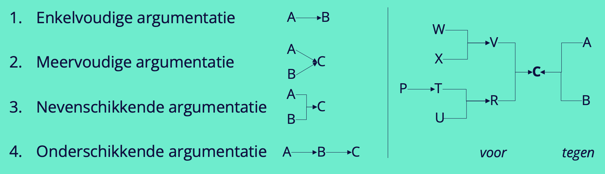

# Choices, Choices - The Tech-stack

## Wrapup

Hoe ver ben je gekomen? Laatste dingen afmaken, elkaar helpen, documentatie op orde brengen, sprint review voorbereiden.

### Aanpak

Vorige sprint hebben we samen een [todo lijst](https://github.com/fdnd-task/your-tribe-for-life-squad-page/blob/main/docs/wrapup.md#oplever-todos) gemaakt met onderdelen voor de het afsluiten van een sprint, we gaan die lijst updaten, mentor feedback verwerken en we gaan aan de slag met het voorbereiden van de retrospect. 

1. Oplevering
2. Argumentatieproces
3. Mentor feedback
4. Voorbereiding retrospect

### Oplevering

We pakken de lijst van de vorige wrap up erbij en kijken of die nog steeds klopt of dat er aanvullingen zijn met inzichten van de huidige sprint. 

### Argumentatie proces

Jullie gaan vrijdag het onderzoek naar tech-stacks presenteren, kies daarbij welke tech-stack voor jou ideaal is in het licht van je teamproject. Het is de bedoeling dat je een solide argumentatie presenteert, daarbij kan je logica goed gebruiken.

In het dagelijks leven zorgt logica voor heldere redenering, betere besluitvorming en solide onderbouwing. Voor frontend-ontwikkelaars vormt logica de basis van programmeerstructuren en gebruikersinteracties. In de filosofie helpt logica bij het structureren en evalueren van argumenten en conceptuele systemen.

**🛠️ Opdracht (15 min)**

1. Formuleer een standpunt en selecteer argumenten: Als je een standpunt hebt inventariseer je welke argumenten voor en welke argumenten tegen je kunt geven. Schrijf die op (en geef ze een simpele variabelenaam, A, B, C, D, E, F etc.)
2. Maak een argumentatieschema, een breakdown voor een argument. Argumenten moeten duidelijk zijn en kloppen. Het standpunt moet aan de hand van argumenten stevig onderbouwd zijn. Zet de argumenten die je gaat gebruiken in een argumentatieschema. Dat geeft een goed overzicht van je onderbouwing. Tools die je kunt gebruiken: enkelvoudige-, meervoudige-, nevenschikkende- en onderschikkende argumentatie. 
3. Beoordeel de aanvaardbaarheid. Het argumentatieschema dat je bij 2 hebt uitgewerkt is handig om te beoordelen of jouw onderbouwing solide is. Om argumenten te beoordelen stel je drie vragen: i) Is de argumentatie inhoudelijk correct? > zijn er genoeg argumenten ‘voor’ het standpunt. ii) Is de argumentatie inhoudelijk voldoende uitgewerkt? > zijn er überhaupt argumenten ‘tegen’? en iii) Ondersteund de argumentatie het standpunt? > worden tegenargumenten weerlegd.
4. Werk je argumentatieschema uit. Het argumentatieschema biedt houvast bij het uitwerken of schrijven van je argument. Je weet immers hoe standpunt en argumenten samenhangen. Let bij het uitwerken op de volgende dingen: Gebruik een logische volgorde. Plaats je standpunt aan het begin en herhaal deze aan het eind van de conclusie. De alinea-indeling volgt de argumentatie. Losstaande argumenten en de uitwerking zijn aparte alinea’s. Argumenten die inhoudelijk bij elkaar horen vormen samen één alinea. Gebruik signaal- en verwijswoorden voor argumentatie om samenhang in de tekst aan te brengen. (Zie taalwinkel.nl)

### Mentor feedback

Veel mentoren hebben feedback gekregen van de eerstejaars. Jullie hebben zelf ook gereflecteerd op je rol als mentor. Vandaag gaan we dit samenvoegen. 

**🛠️ Opdracht mentor feedback (30 minuten)**  

1. Beschrijf het "tekort" en een "teveel" bij elk van je taken als [mentor](https://github.com/fdnd-task/mentor/blob/main/docs/INSTRUCTIONS.md#werkwijze), en maak hier een lijn van:

```
"Tekort" ----------------------------------- "teveel"
```

```
- Je bent één keer per week aanwezig op het afgesproken moment
- Je stapt actief op eerstejaars studenten af om ze te helpen
- Je luistert, vat samen en vraagt door bij het helpen van studenten
- Je bereidt de workshops voor en helpt de studenten bij de opdracht die ze krijgen
- Je beantwoordt vragen over HTML, CSS en JS
- Je doet code/design reviews op leertaken
- Je geeft feedback in issues van eerstejaars
- Optioneel: Als je het leuk vindt, mag je zelf een workshop of presentatie geven
```

2. Plaats jouw functioneren als mentor per taak op de lijn aan de hand van jouw eigen reflectie. Doe dit door een streepje op de lijn te zetten.

3. Lees nu de feedback die je hebt gekregen van de eerstejaars. Bepaal per taak op basis van de ontvangen feedback de positie op de lijn waar mentees je zouden plaatsen, zet hier een duidelijke stip. NB: ook geen feedback is feedback over jouw rol als mentor!

4. Bepaal per taak het punt waar je na volgende periode zou willen staan.

5. Formuleer verbeterpunten in je mentorschap om de gewenste positie te bereiken. Neem in je overweging de eerder voorgenomen verbeteringen mee.

### Voorbereiding retrospect

Tijdens de retrospect gaan we met de volgende onderdelen aan de slag:

1. Presentaties techstack
2. Backlog
3. Portflow bewijslast
4. Schets je ontwikkeling


#### 1. Presentaties

#### 2. Backlog

Zorg ervoor dat vrijdag je backlog op orde is voor de sprintplanning. Dat betekent:

- Opschonen huidige sprint, zet alles in de juiste kolom. 
- Indien er iets niet is opgepakt zet het dan terug op de backlog op de juiste positie qua prioriteit
- Doe een [refinement](https://github.com/fdnd-task/choices-choices-the-tech-stack/blob/main/docs/projectinrichting.md#1-refinement). _BELANGRIJK:_ gebruik het estimate field op een issue om de pokerplanning waarde in te vullen. 

#### 3. Portflow bewijslast:
Voor vrijdag hebben jullie portflow bewijslast klaar om te mappen op indicatoren, inclusief STARR's. 

1. S15: Refinement
2. S15: Code & Design Review W1
3. S15: Mentorschap
4. S15: Techstack beargumentatie 

#### Extra bronnen
<!-- Extra links voor documentatie en tutorials -->


### 💪 Extra uitdagingen
<!-- Dit is optioneel voor de hardlopers die iets extra's willen. -->


### ✒️ Leervragen
<!-- 
@TODO:
1. Hoe vond je het om feedback van eerstejaars te ontvangen?
2. 
3. 

 -->